# Nice-TTS 项目重构设计

## 概述

Nice-TTS 是一个基于 AI 的命令行工具，专注于音频转录和会议摘要生成，特别针对中文语言处理进行优化。本重构设计旨在提升代码架构、可维护性、扩展性和用户体验。

### 当前架构问题分析

1. **单体式模块设计**：transcription.py 和 llm.py 职责过于集中，缺乏模块化
2. **配置管理混乱**：环境变量加载逻辑分散，缺乏统一配置管理
3. **错误处理不一致**：不同模块的错误处理方式不统一
4. **测试覆盖率低**：缺乏系统性单元测试
5. **扩展性限制**：难以添加新的转录引擎或 LLM 提供商
6. **CLI 逻辑耦合**：命令行逻辑与业务逻辑耦合过紧

## 重构目标

- 提升代码模块化和可维护性
- 增强系统扩展性和配置管理
- 统一错误处理和日志记录
- 完善测试覆盖率
- 改善用户体验和性能

## 架构设计

### 整体架构图

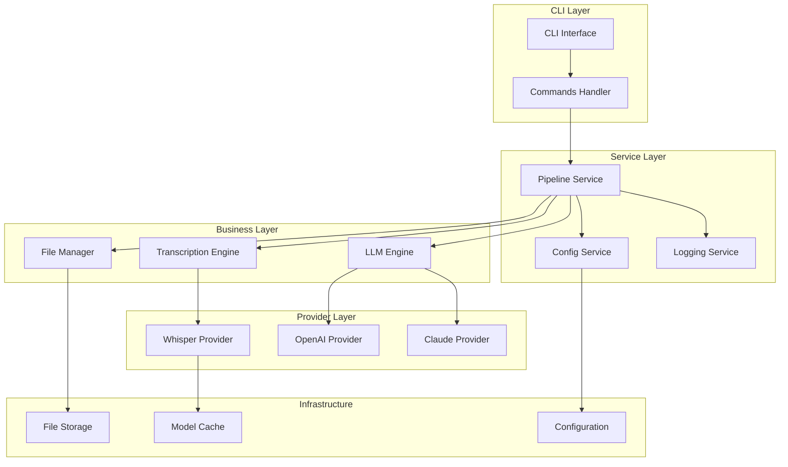

### 核心组件设计

#### 1. 配置管理系统

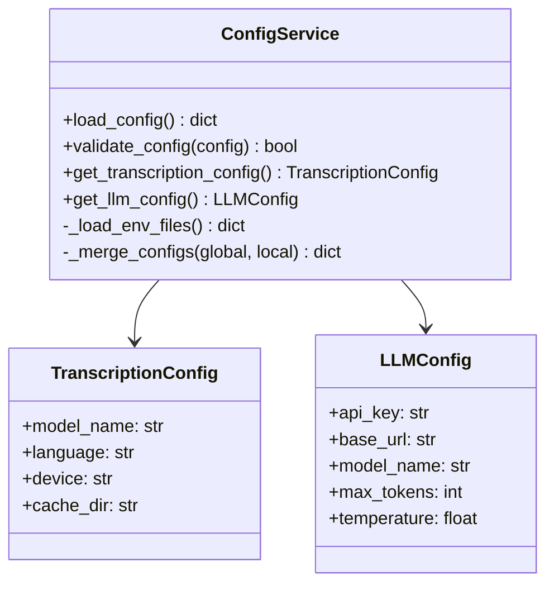

#### 2. 转录引擎抽象

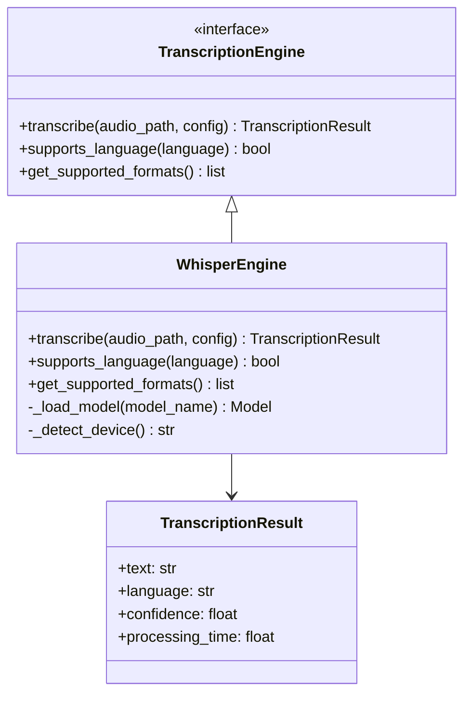

#### 3. LLM 引擎抽象

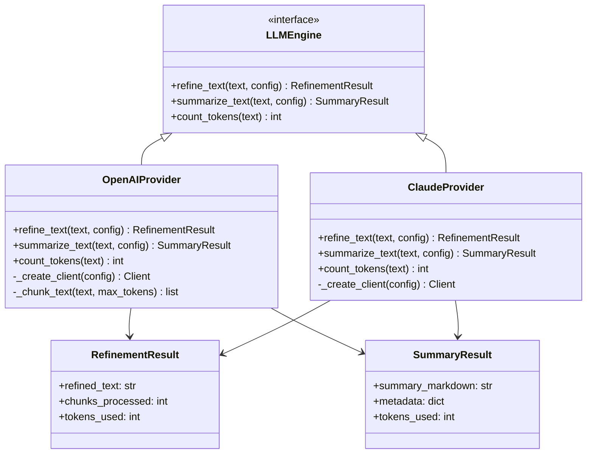

#### 4. 处理流水线

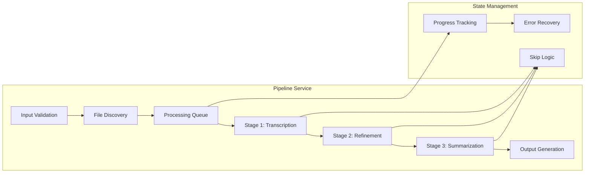

## 新模块结构

### 目录结构设计

```
src/nice_tts/
├── __init__.py
├── main.py                     # CLI 入口
├── cli/                        # CLI 层
│   ├── __init__.py
│   ├── commands.py             # 命令处理器
│   └── validators.py           # 参数验证器
├── core/                       # 核心业务层
│   ├── __init__.py
│   ├── pipeline.py             # 处理流水线
│   ├── config.py               # 配置管理
│   └── exceptions.py           # 异常定义
├── engines/                    # 引擎抽象层
│   ├── __init__.py
│   ├── transcription/
│   │   ├── __init__.py
│   │   ├── base.py             # 转录引擎基类
│   │   └── whisper.py          # Whisper 实现
│   └── llm/
│       ├── __init__.py
│       ├── base.py             # LLM 引擎基类
│       ├── openai_provider.py  # OpenAI 实现
│       └── claude_provider.py  # Claude 实现
├── utils/                      # 工具层
│   ├── __init__.py
│   ├── file_manager.py         # 文件管理
│   ├── logger.py               # 日志管理
│   └── progress.py             # 进度显示
└── tests/                      # 测试
    ├── __init__.py
    ├── unit/
    ├── integration/
    └── fixtures/
```

### 配置系统设计

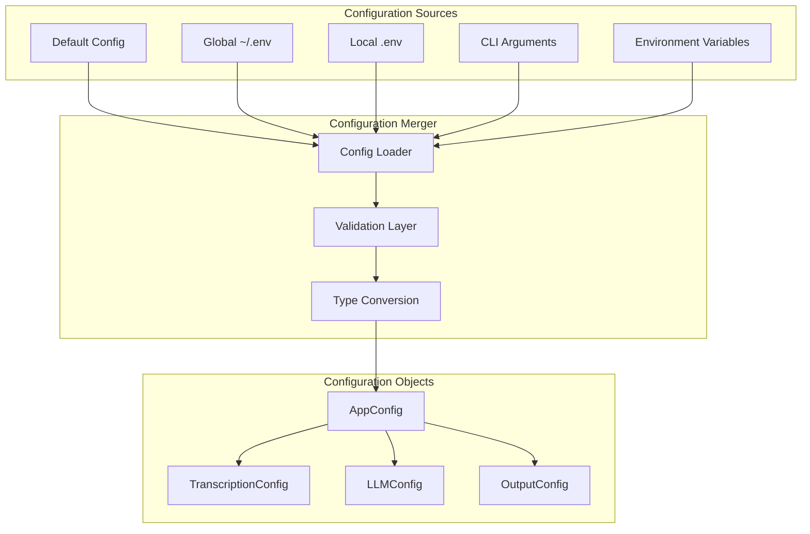

## 数据流设计

### 处理流水线数据流

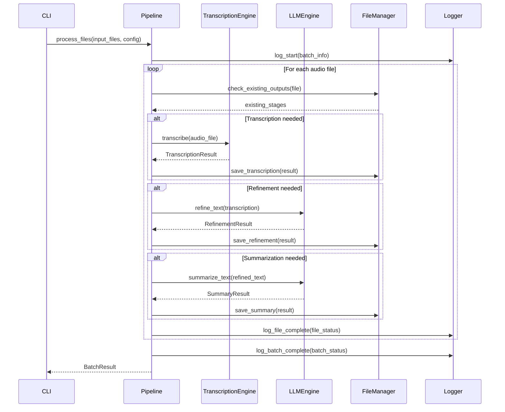

### 错误处理流程

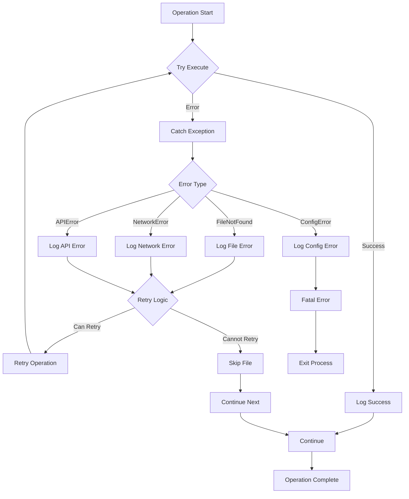

## 接口设计

### CLI 接口优化

```python
# 改进的 CLI 命令结构
@app.command()
def process(
    input_path: Path,
    output_dir: Path = Path("output"),
    config_file: Optional[Path] = None,
    transcription_model: str = "large-v3-turbo",
    language: str = "zh",
    llm_provider: str = "openai",
    force_reprocess: bool = False,
    parallel_jobs: int = 1,
    verbose: bool = False
) -> None:
    """处理音频文件并生成转录和摘要"""
    
@app.command()
def config(
    action: str = typer.Argument(..., help="Action: show, validate, init"),
    config_file: Optional[Path] = None
) -> None:
    """配置管理命令"""
    
@app.command() 
def list_models() -> None:
    """列出可用的转录和 LLM 模型"""
```

### 服务接口

```python
# 核心服务接口
class ProcessingPipeline:
    def __init__(self, config: AppConfig):
        self.config = config
        self.transcription_engine = self._create_transcription_engine()
        self.llm_engine = self._create_llm_engine()
        self.file_manager = FileManager(config.output)
        self.logger = Logger(config.logging)
    
    async def process_batch(
        self, 
        input_files: List[Path], 
        progress_callback: Optional[Callable] = None
    ) -> BatchResult:
        """批量处理音频文件"""
        
    async def process_single(
        self, 
        input_file: Path,
        progress_callback: Optional[Callable] = None
    ) -> FileResult:
        """处理单个音频文件"""
```

## 测试策略

### 测试架构

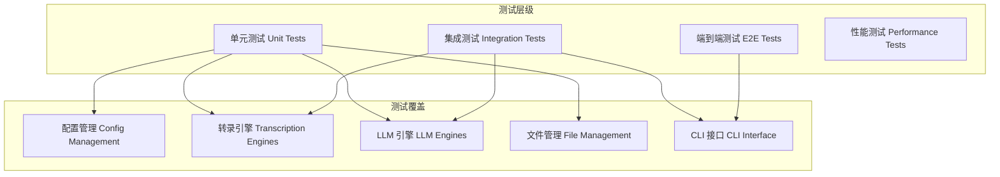

### 测试用例设计

#### 单元测试覆盖

1. **配置管理测试**
   - 配置文件加载和合并
   - 环境变量处理
   - 配置验证逻辑

2. **转录引擎测试**  
   - 模型加载和缓存
   - 音频格式支持验证
   - GPU/CPU 设备检测

3. **LLM 引擎测试**
   - Token 计数准确性
   - 文本分块算法  
   - API 调用处理

4. **文件管理测试**
   - 文件路径处理
   - 输出文件生成
   - 跳过逻辑验证

## 性能优化

### 并发处理设计

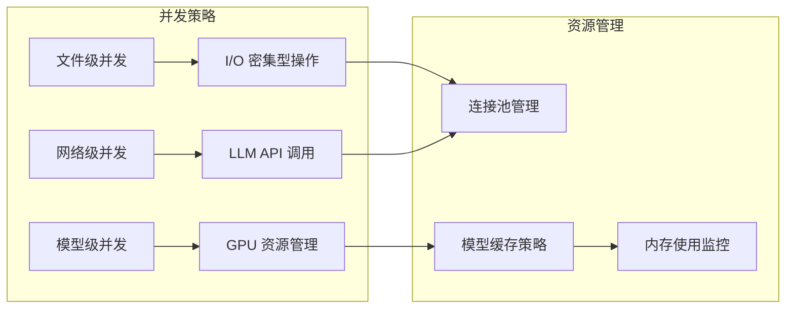

### 缓存策略

1. **模型缓存**：Whisper 模型本地缓存和版本管理
2. **结果缓存**：处理结果的智能缓存和失效策略  
3. **配置缓存**：运行时配置对象缓存

### 内存优化

1. **流式处理**：大文件的分块流式处理
2. **懒加载**：按需加载模型和资源
3. **垃圾回收**：及时释放不需要的对象

## 向后兼容性

### 迁移策略

1. **配置文件迁移**
   - 自动检测旧版本配置格式
   - 提供配置迁移工具
   - 保持向后兼容的环境变量名

2. **CLI 接口兼容**
   - 保持现有命令行参数
   - 添加新功能时使用可选参数
   - 提供弃用警告机制

3. **输出格式兼容**  
   - 维持现有输出文件格式
   - 新功能通过可选参数启用

## 扩展性设计

### 插件架构

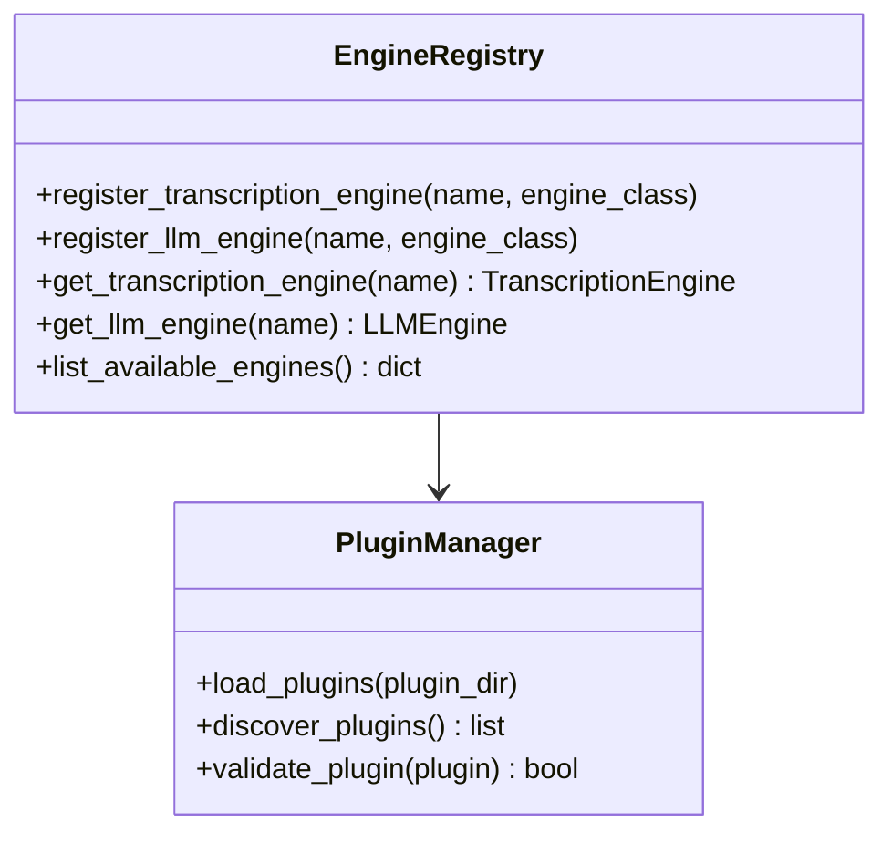

### 新引擎集成

1. **转录引擎扩展**
   - Azure Speech Services
   - Google Speech-to-Text  
   - 自定义本地模型

2. **LLM 引擎扩展**
   - 智谱 ChatGLM
   - 百度文心一言
   - 本地 Ollama 模型

## 部署和分发

### 打包策略

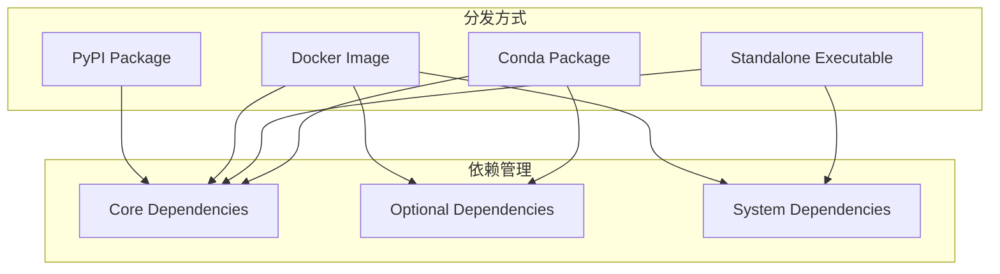

### 配置管理

1. **多环境配置**：开发、测试、生产环境配置分离
2. **默认配置**：合理的默认值减少配置负担  
3. **配置验证**：启动时配置完整性检查

## 监控和日志

### 日志系统设计

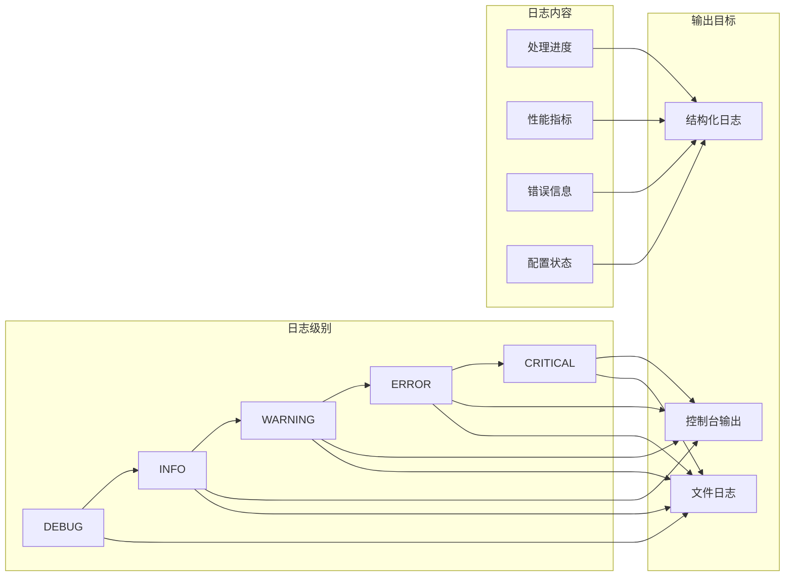

### 监控指标

1. **性能指标**
   - 文件处理速度  
   - API 响应时间
   - 内存和 CPU 使用率

2. **业务指标**
   - 处理成功率
   - 错误分布统计
   - 模型使用情况

3. **系统指标**
   - 磁盘空间使用
   - 网络请求状态
   - 配置加载状态