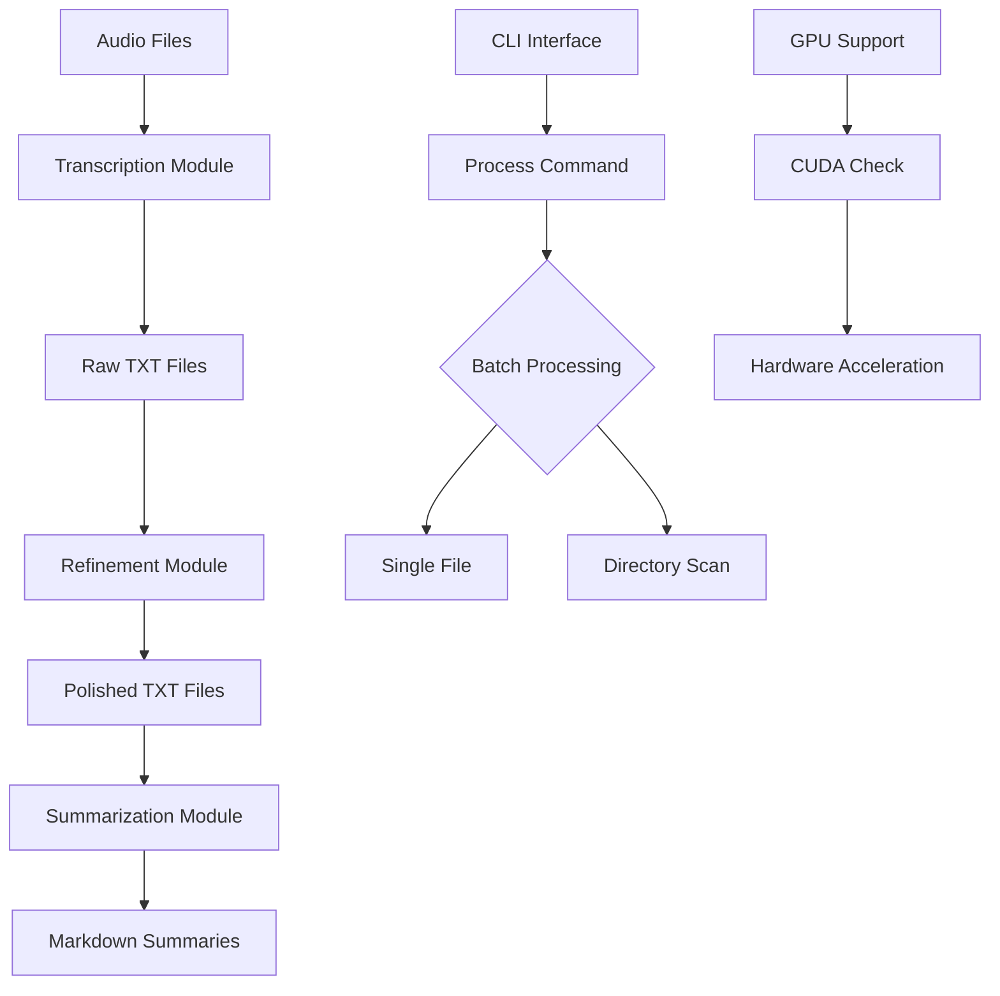
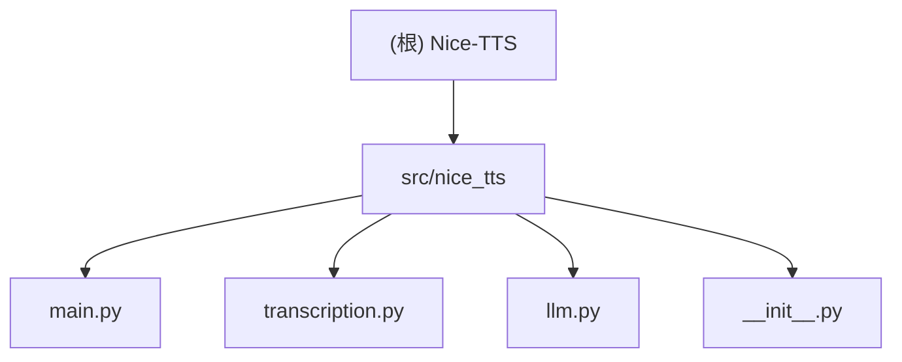

# Nice-TTS: AI-Powered Transcription and Summarization CLI

A Python CLI tool for text-to-speech processing with transcription capabilities, supporting various audio formats and LLM integration. Optimized for Chinese language processing with AI-powered refinement and summarization.

## Project Vision

Nice-TTS aims to provide a seamless, batch-capable command-line experience for transforming audio recordings into polished, summarized meeting minutes. The tool is specifically optimized for Chinese language content while maintaining support for other languages.

## Architecture Overview

The project follows a modular CLI architecture with three distinct processing stages:

1. **Transcription**: Audio → Raw text using OpenAI Whisper
2. **Refinement**: Raw text → Polished transcript using LLM
3. **Summarization**: Polished transcript → Meeting summary using LLM



## Module Structure



## Module Index

| Module | Purpose | Language | Entry Point | Test Coverage |
|--------|---------|----------|-------------|---------------|
| [src/nice_tts](./src/nice_tts) | Core CLI application | Python | main.py | Manual testing via CLI |
| [transcription](./src/nice_tts/transcription) | Audio-to-text transcription | Python | transcribe_audio() | Self-test with dummy audio |
| [llm](./src/nice_tts/llm) | LLM-powered text refinement | Python | refine_transcript(), summarize_transcript() | Manual verification |

## Running & Development

### Prerequisites
- Python 3.11+
- `uv` package manager
- `ffmpeg` (for audio processing)
- CUDA-enabled GPU (optional, for acceleration)

### Quick Start
```bash
# Setup environment
uv venv && source .venv/bin/activate  # Windows: .venv\Scripts\activate
uv pip install -e .

# Configure API credentials
cp .env.example .env
# Edit .env with your OpenAI API key

# Check GPU support
nice-tts check-gpu

# Process audio files
nice-tts process ./example.wav
nice-tts process ./recordings/ --output-dir results/
```

### Development Commands
```bash
# Install in development mode
uv pip install -e .

# Run with debug output
python -m nice_tts.main check-gpu

# Test transcription module
python -m nice_tts.transcription
```

## Testing Strategy

- **Manual CLI Testing**: Primary testing method via command-line interface
- **Self-test Mode**: `transcription.py` includes automated test with dummy audio
- **GPU Testing**: Dedicated `check-gpu` command for hardware verification
- **Integration Testing**: End-to-end processing pipeline testing

## Coding Standards

- **Language**: Python 3.11+
- **Style**: PEP 8 compliant
- **Type Hints**: Progressive adoption (used in key functions)
- **Documentation**: Docstrings for all public functions
- **Configuration**: Environment-based configuration via `.env` files

## AI Usage Guidelines

- **LLM Integration**: OpenAI-compatible APIs with fallback support
- **Token Management**: Automatic chunking for large texts
- **Prompt Engineering**: Chinese-optimized prompts for better results
- **Model Flexibility**: Configurable model selection via environment variables

## Change Log

### 2025-09-04 - Initial Architecture Documentation
- Created comprehensive project documentation
- Identified three core modules: CLI, Transcription, LLM
- Documented processing pipeline and architecture
- Added Mermaid diagrams for visual representation

### Recent Commits
- **ea704a4**: Merge pull request #5 - Replace tiktoken with transformers
- **5edeeb5**: Refactor: Replace tiktoken with transformers and remove no-ssl-verify
- **9bb23eb**: Merge pull request #4 - Add txt output and LLM token chunking
- **22f6e75**: feat: Add txt output, LLM token chunking, and SSL fix
- **5d86c32**: Merge pull request #3 - Feature additions