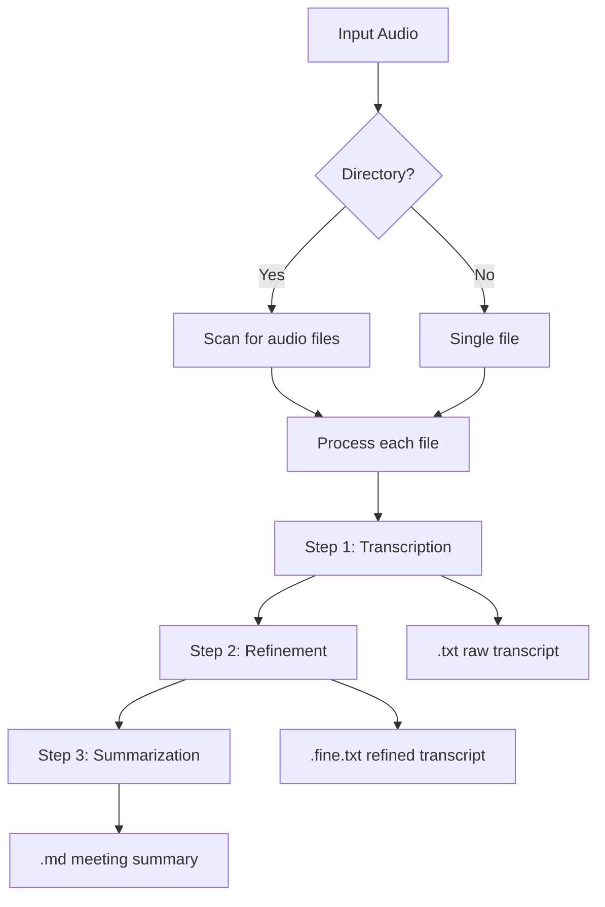

[根目录](../../../CLAUDE.md) > [src](../) > **nice_tts**

# Nice-TTS CLI Module

The main CLI application module providing the command-line interface for audio transcription and summarization processing.

## Module Responsibility

This module serves as the primary entry point for the Nice-TTS CLI tool, orchestrating the three-stage processing pipeline:
1. Audio transcription using Whisper
2. Text refinement using LLM
3. Meeting summarization using LLM

## Entry & Launch

**Primary Entry Point**: `main.py`
- **CLI Command**: `nice-tts` (defined in pyproject.toml)
- **Launch Method**: `python -m nice_tts.main` or `nice-tts [command]`

## CLI Interface

### Available Commands

#### `process` - Main Processing Command
```bash
# Basic usage
nice-tts process /path/to/audio.wav

# Advanced usage
nice-tts process ./recordings/ --output-dir results/ --language zh --model large-v3-turbo --force
```

**Parameters**:
- `input_path`: Audio file or directory (required)
- `--model`: Whisper model (default: large-v3-turbo)
- `--language`: Audio language (default: zh)
- `--output-dir`: Output directory (default: out)
- `--force`: Force re-processing (default: false)

#### `check-gpu` - Hardware Verification
```bash
nice-tts check-gpu
```

**Output**: CUDA availability, GPU count, device information

## Supported Audio Formats

- **Extensions**: `.wav`, `.mp3`, `.m4a`, `.ogg`
- **Processing**: Both single files and batch directory processing
- **Language Support**: Configurable via `--language` parameter

## File Processing Pipeline



## Output File Structure

For each processed audio file `example.wav`:
- `example.txt`: Raw transcription from Whisper
- `example.fine.txt`: Refined transcript from LLM
- `example.md`: Meeting summary in Markdown format

## Key Dependencies

- **CLI Framework**: `typer[all]` - Modern CLI framework
- **Audio Processing**: `openai-whisper` - OpenAI's Whisper transcription
- **ML Framework**: `torch`, `torchvision`, `torchaudio` - PyTorch ecosystem
- **LLM Integration**: `openai` - OpenAI API client
- **Environment**: `python-dotenv` - Environment configuration
- **Token Processing**: `transformers` - Hugging Face tokenizers

## Configuration

### Environment Variables
Configuration loaded from `.env` files (local then global):
- `OPENAI_API_KEY`: API key for LLM services
- `OPENAI_API_BASE`: API endpoint (default: https://api.openai.com/v1)
- `OPENAI_MODEL_NAME`: LLM model name (default: gpt-4)

### Smart Processing Features
- **Skip Logic**: Automatically skips completed steps if output exists
- **Force Mode**: `--force` flag to re-process all steps
- **Progress Reporting**: Color-coded console output
- **Error Handling**: Graceful error handling with informative messages

## Testing & Quality

### Manual Testing Workflow
```bash
# Test GPU support
nice-tts check-gpu

# Test single file processing
nice-tts process example.wav --force

# Test batch processing
nice-tts process test_samples/ --output-dir test_results/
```

### Verification Points
- ✅ CLI commands respond correctly
- ✅ Audio files are processed
- ✅ Output files are generated
- ✅ GPU detection works
- ✅ Error messages are helpful

## Common Issues & Solutions

### "No audio files found"
- **Cause**: Directory contains no supported audio formats
- **Solution**: Check file extensions (.wav, .mp3, .m4a, .ogg)

### "CUDA not available"
- **Cause**: GPU drivers not installed or incompatible
- **Solution**: Install CUDA drivers or use CPU mode

### "Missing API key"
- **Cause**: `.env` file not configured
- **Solution**: Copy `.env.example` to `.env` and add API credentials

## Related Files

- `pyproject.toml`: Package configuration and dependencies
- `.env.example`: Environment variable template
- `README.md`: User documentation
- `transcription.py`: Audio processing module
- `llm.py`: LLM integration module

## Change Log

### 2025-09-04 - Module Documentation
- Documented CLI interface and commands
- Added processing pipeline diagrams
- Listed supported formats and configuration
- Added testing workflows and troubleshooting