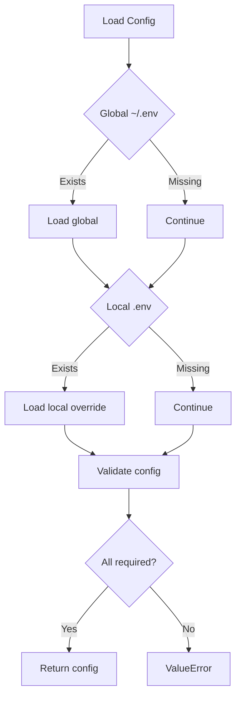

[根目录](../../../../CLAUDE.md) > [src](../..) > [nice_tts](..) > **llm**

# LLM Module

Large Language Model integration module for text refinement and meeting summarization, optimized for Chinese language processing.

## Module Responsibility

This module handles the second and third stages of the Nice-TTS pipeline:
1. **Text Refinement**: Converting raw transcripts into polished, readable text
2. **Meeting Summarization**: Generating structured meeting summaries from refined text

## Core Functionality

### Text Refinement: `refine_transcript()`

**Purpose**: Polish raw transcription into refined Chinese text

**Signature**:
```python
def refine_transcript(txt_path: str, output_fine_path: str) -> str
```

**Chinese Optimization**: Uses Chinese prompts specifically designed for:
- Fixing ASR errors in Chinese text
- Removing Chinese filler words (嗯, 呃, 那个, 就是说)
- Optimizing Chinese punctuation
- Maintaining Chinese context and meaning

### Meeting Summarization: `summarize_transcript()`

**Purpose**: Generate structured meeting summaries from refined text

**Signature**:
```python
def summarize_transcript(
    refined_text_path: str, 
    original_audio_path: str, 
    output_md_path: str
) -> str
```

**Output Format**: Chinese-language Markdown with:
- 会议详情 (Meeting Details)
- 纪要概述 (Summary Overview)
- 主要讨论点 (Key Discussion Points)
- 行动项 (Action Items)
- 关键决策 (Key Decisions)
- 相关文件 (Related Files with links)

## Configuration Management

### Environment Variable Loading


### Required Environment Variables
- `OPENAI_API_KEY`: API key for LLM service
- `OPENAI_API_BASE`: API endpoint URL
- `OPENAI_MODEL_NAME`: Model identifier (e.g., "gpt-4")
- `LLM_TOKEN_MAX`: Maximum tokens per request (default: 128000)

### Configuration Resolution Order
1. Global `~/.env` (lowest priority)
2. Local `.env` in current directory (highest priority)
3. System environment variables (fallback)

## Token Management

### Intelligent Chunking Strategy
- **Token Counting**: Uses Hugging Face transformers for accurate tokenization
- **Chunking Logic**: Splits by paragraphs first, then sentences
- **Context Preservation**: Maintains logical boundaries between chunks
- **Model Cache**: Tokenizer cached for performance

### Chunking Algorithm
```python
# High-level approach
1. Count total tokens
2. If under limit → process as single chunk
3. If over limit → split by paragraphs
4. For oversized paragraphs → split by sentences/words
5. Process each chunk separately
6. Combine results with appropriate separators
```

## Chinese-Optimized Prompts

### Refinement Prompt (Chinese)
Uses professional Chinese language for:
- **速记稿后期处理专家** (Transcript refinement expert)
- **润色和修正** (Polishing and correction)
- **优化标点符号** (Punctuation optimization)
- **去除冗余** (Redundancy removal)
- **合并与分段** (Merging and paragraphing)

### Summarization Prompt (Chinese)
Uses **会议助理** (Meeting assistant) role for:
- **会议主题** (Meeting topic)
- **会议日期** (Meeting date)
- **参会人员** (Participants)
- **结构化输出** (Structured output in Chinese)

## Output File Structure

### Refined Transcript (.fine.txt)
- **Format**: Clean Chinese text
- **Content**: Polished meeting transcript
- **Encoding**: UTF-8
- **Structure**: Paragraph-separated text

### Meeting Summary (.md)
```markdown
# [会议主题]

## 会议详情
- **会议主题**: [Inferred topic]
- **会议日期**: [Inferred date or current date]
- **参会人员**: [Identified participants or "参会人员未明确"]

## 纪要概述
[One-paragraph summary of meeting purpose and outcomes]

## 主要讨论点
- [Bullet points of key discussion topics]

## 行动项
1. [Action items with assignees]

## 关键决策
- [Key decisions made]

## 相关文件
- 原始录音: [./audio_file.wav](./audio_file.wav)
- 原始文本: [./audio_file.txt](./audio_file.txt)
- 精校文本: [./audio_file.fine.txt](./audio_file.fine.txt)
```

## Error Handling

### Configuration Errors
- **Missing API Key**: Clear error message with setup instructions
- **Invalid URL**: Connection error handling
- **Model Unavailable**: Fallback suggestions

### Processing Errors
- **File Not Found**: Input file validation
- **Empty Content**: Warning and graceful handling
- **API Errors**: Retry logic and user-friendly messages
- **Token Limits**: Automatic chunking fallback

### Network Issues
- **Connection Timeout**: Configurable retry attempts
- **Rate Limiting**: Exponential backoff
- **API Errors**: Detailed error reporting

## Performance Optimizations

### Tokenizer Caching
- **Global Cache**: Single tokenizer instance per model
- **Model-based**: Cache keyed by model name
- **Fallback Strategy**: GPT-2 tokenizer if specified model fails

### Batch Processing
- **Sequential Processing**: One chunk at a time to avoid rate limits
- **Progress Reporting**: Real-time progress updates
- **Memory Management**: Streaming approach for large texts

## Dependencies

### Core Dependencies
- `openai`: OpenAI API client
- `transformers`: Hugging Face tokenizers
- `python-dotenv`: Environment configuration
- `typer`: CLI output formatting

### Model Support
- **Tokenizer Models**: Any Hugging Face tokenizer
- **LLM Models**: Any OpenAI-compatible API
- **Fallback**: GPT-2 tokenizer for universal compatibility

## Testing & Validation

### Manual Testing Workflow
```bash
# Test configuration loading
python -c "from nice_tts.llm import load_llm_config; print(load_llm_config())"

# Test refinement
nice-tts process example.wav --force
# Check .fine.txt output

# Test summarization
# Check .md output format and content
```

### Validation Points
- ✅ Configuration loading from .env
- ✅ Token counting accuracy
- ✅ Chinese prompt effectiveness
- ✅ Output format compliance
- ✅ Error handling robustness
- ✅ Chunking algorithm correctness

## Common Issues & Solutions

### "Could not load tokenizer"
- **Cause**: Network issues or model name typo
- **Solution**: Check internet connection or use GPT-2 fallback

### "Rate limit exceeded"
- **Cause**: Too many API requests
- **Solution**: Implement delays or upgrade API plan

### "Invalid API key"
- **Cause**: Wrong key or endpoint configuration
- **Solution**: Verify .env configuration

### "Content too long"
- **Cause**: Text exceeds model limits
- **Solution**: Automatic chunking should handle this

## Integration Points

### With CLI Module
- Called from `main.py` after transcription
- Accepts file paths, returns file paths
- Provides progress feedback via print statements

### With Transcription Module
- Consumes raw .txt files from transcription
- Outputs .fine.txt and .md files
- Language parameter inherited from CLI

## Security Considerations

### API Key Management
- **Never commit**: API keys in repository
- **Environment isolation**: Separate .env files per environment
- **Access control**: Restricted file permissions for .env

### Data Privacy
- **Local processing**: No cloud storage of audio/text
- **API transmission**: Only text content sent to LLM
- **Output retention**: User-controlled file management

## File Structure

```
llm.py                    # Main module file
├── load_llm_config()     # Configuration loading
├── _count_tokens()       # Token counting utility
├── _split_text_into_chunks() # Text chunking
├── refine_transcript()   # Text refinement
└── summarize_transcript() # Meeting summarization
```

## Change Log

### 2025-09-04 - Module Documentation
- Documented LLM integration architecture
- Added Chinese prompt specifications
- Documented token management strategy
- Added configuration validation workflow

### Recent Features
- **Chinese Optimization**: Specialized prompts for Chinese content
- **Token Chunking**: Automatic handling of large texts
- **Model Flexibility**: Support for any OpenAI-compatible API
- **Progress Reporting**: Real-time processing feedback
- **Error Handling**: Comprehensive error management