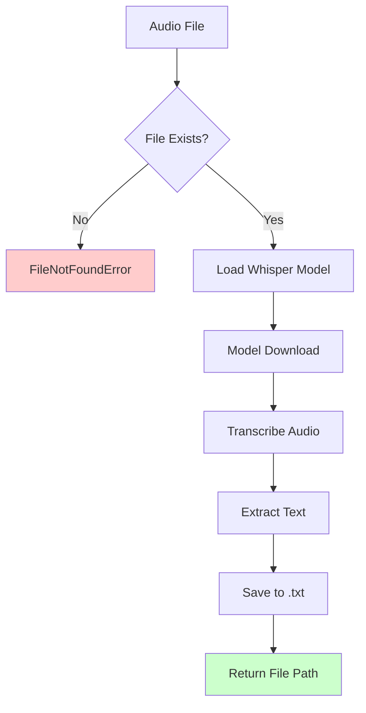

[根目录](../../../../CLAUDE.md) > [src](../..) > [nice_tts](..) > **transcription**

# Transcription Module

Audio-to-text transcription module using OpenAI's Whisper models for converting audio files into text transcripts.

## Module Responsibility

This module handles the first stage of the Nice-TTS pipeline: converting audio files into raw text transcripts using OpenAI's Whisper automatic speech recognition (ASR) models.

## Core Functionality

### Primary Function: `transcribe_audio()`

**Purpose**: Transcribe audio file to text using Whisper

**Signature**:
```python
def transcribe_audio(
    audio_path: str, 
    output_txt_path: str, 
    model_name: str = "base", 
    language: str = "en"
) -> str
```

**Parameters**:
- `audio_path`: Path to input audio file
- `output_txt_path`: Output path for .txt file
- `model_name`: Whisper model variant (default: "base")
- `language`: Audio language (default: "en", "zh" for Chinese)

**Returns**: Path to generated .txt file

## Supported Audio Formats

- **Primary**: WAV files (tested extensively)
- **Secondary**: MP3, M4A, OGG (via ffmpeg)
- **Requirement**: ffmpeg must be installed system-wide

## Whisper Model Options

| Model | Size | English Only | Multilingual | Relative Speed |
|-------|------|--------------|--------------|----------------|
| tiny | 39 MB | ✅ | ✅ | ~32x |
| base | 74 MB | ✅ | ✅ | ~16x |
| small | 244 MB | ✅ | ✅ | ~6x |
| medium | 769 MB | ✅ | ✅ | ~2x |
| large | 1550 MB | ❌ | ✅ | 1x |
| large-v2 | 1550 MB | ❌ | ✅ | 1x |
| large-v3 | 1550 MB | ❌ | ✅ | 1x |
| large-v3-turbo | 809 MB | ❌ | ✅ | ~8x |

## Language Support

- **Chinese**: `language="zh"` (optimized for Nice-TTS)
- **English**: `language="en"` (default fallback)
- **Other**: Any language supported by Whisper

## Processing Pipeline



## Error Handling

### File System Errors
- **FileNotFoundError**: Audio file not found
- **PermissionError**: Insufficient file permissions
- **IOError**: General I/O issues

### Model Errors
- **Download Issues**: Automatic retry on model download
- **Memory Issues**: Large models may require significant RAM
- **Language Mismatch**: Whisper will auto-detect if language not specified

## Performance Characteristics

- **GPU Acceleration**: Automatic CUDA detection and usage
- **CPU Fallback**: Functional on CPU but significantly slower
- **Memory Usage**: Varies by model size (39MB - 1.5GB)
- **Processing Speed**: Real-time to ~32x real-time depending on model

## Testing & Self-Verification

### Built-in Test Mode
The module includes a self-test feature that:
1. Creates dummy audio file (3-second sine wave)
2. Transcribes using "tiny" model
3. Outputs results to console

**Run Test**:
```bash
python -m nice_tts.transcription
```

### Expected Test Output
```
Creating a dummy audio file 'test_transcription_output/example_test.wav' for testing.
--- Testing Transcription (English) ---
Loading Whisper model 'tiny'...
Transcribing test_transcription_output/example_test.wav (Language: en)...
Transcription saved to test_transcription_output/example_test.txt

--- TXT File Content ---
[Transcription result]
------------------------
```

## Dependencies

### Core Dependencies
- `openai-whisper`: OpenAI's Whisper implementation
- `torch`: PyTorch for model inference
- `torchaudio`: Audio processing utilities

### Development Dependencies
- `scipy`: For test audio generation
- `numpy`: Numerical computations

## Configuration

### Environment Impact
- **Model Cache**: Whisper models cached in `~/.cache/whisper/`
- **CUDA**: Automatic GPU detection via PyTorch
- **FFmpeg**: System requirement, not Python package

### Model Selection Strategy
- **Development**: Use "tiny" or "base" for faster iteration
- **Production**: Use "large-v3-turbo" for balance of speed/accuracy
- **Accuracy**: Use "large-v3" for best quality (slower)

## Common Issues & Troubleshooting

### "ffmpeg not found"
```bash
# Ubuntu/Debian
sudo apt install ffmpeg

# macOS
brew install ffmpeg

# Windows
# Download from https://ffmpeg.org/download.html
```

### "CUDA out of memory"
- **Solution**: Use smaller model or process shorter audio
- **Models**: tiny < base < small < medium < large

### "Model download fails"
- **Cause**: Network issues or proxy configuration
- **Solution**: Manual model download or check network settings

## Integration Points

### With CLI Module
- Called from `main.py` via `transcription.transcribe_audio()`
- Returns file path for next processing stage
- Handles file I/O internally

### With LLM Module
- Provides raw text input for refinement
- Text format: Plain UTF-8 text, no timestamps
- Language metadata passed through filename conventions

## File Structure

```
transcription.py          # Main module file
test_transcription_output/ # Auto-generated test directory
├── example_test.wav      # Dummy audio file
└── example_test.txt      # Test transcription output
```

## Change Log

### 2025-09-04 - Module Documentation
- Documented transcription workflow and parameters
- Added model comparison table
- Added self-test instructions
- Documented troubleshooting guide

### Recent Features
- **Language Parameter**: Added configurable language support
- **Model Flexibility**: Support for all Whisper model variants
- **Error Handling**: Improved error messages and handling
- **Self-test Mode**: Automated verification capability